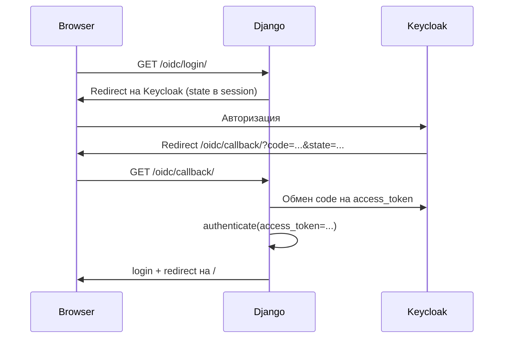

# django-keycloak-oidc-auth

Библиотека для интеграции Django с [Keycloak](https://www.keycloak.org/) через OpenID Connect (OIDC). Пакет предоставляет authentication backend и готовые view для входа, callback и выхода.

Построен на [mozilla-django-oidc](https://github.com/mozilla/mozilla-django-oidc) и Django 4.

## Возможности

- OIDC-авторизация через Keycloak (authorization code flow)
- Автоматическое создание пользователей Django при первом входе
- Поиск существующих пользователей по email из OIDC claims
- Назначение прав staff/superuser для указанного email
- Готовые view для login, callback и logout

## Требования

- Python >= 3.10
- Django 4.x
- Работающий Keycloak realm с настроенным OIDC-клиентом

## Установка

### Из исходников (uv)

```bash
git clone <url-репозитория>
cd django_keycloak_oidc_auth
uv sync
```

### В существующий Django-проект

```bash
uv add django-keycloak-oidc-auth
# или
pip install django-keycloak-oidc-auth
```

## Настройка Keycloak

1. Создайте клиент в нужном realm (тип: **OpenID Connect**).
2. Включите **Standard flow** (Authorization Code).
3. Укажите **Valid redirect URIs**, например:
   ```
   https://your-app.example.com/oidc/callback/
   http://localhost:8000/oidc/callback/
   ```
4. Сохраните **Client ID** и **Client Secret** — они понадобятся в настройках Django.

## Настройка Django

### Переменные окружения / settings.py

```python
# Keycloak
DKA_BASE_URL = "keycloak.example.com"   # хост без https://
DKA_REALM = "my-realm"
DKA_CLIENT_ID = "django-app"
DKA_CLIENT_SECRET = "your-client-secret"

# Необязательно: email пользователя, которому при первом входе
# выдаются is_staff и is_superuser
DKA_SUPER_USER_EMAIL = "admin@example.com"
```

### INSTALLED_APPS и backend

```python
INSTALLED_APPS = [
    # ...
    "django_keycloak_oidc_auth",
]

AUTHENTICATION_BACKENDS = [
    "django_keycloak_oidc_auth.backends.KeycloakBackend",
    "django.contrib.auth.backends.ModelBackend",
]
```

### URL-маршруты

Подключите встроенные маршруты app в `urls.py` вашего проекта:

```python
from django.urls import include, path

urlpatterns = [
   path("oidc/", include("django_keycloak_oidc_auth.urls")),
]
```

Будут доступны маршруты:

- `/oidc/login/`
- `/oidc/callback/`
- `/oidc/logout/`

### Сессии

Убедитесь, что в проекте настроены сессии — view сохраняют `oidc_state` и `oidc_refresh_token` в session:

```python
SESSION_ENGINE = "django.contrib.sessions.backends.db"  # или другой подходящий backend
```

## Как это работает



1. Пользователь переходит на `/oidc/login/`.
2. Приложение генерирует `state`, сохраняет его в сессии и перенаправляет на Keycloak.
3. После успешной авторизации Keycloak возвращает пользователя на `/oidc/callback/` с `code` и `state`.
4. Приложение проверяет `state`, обменивает `code` на токены и вызывает `authenticate()` с `access_token`.
5. Backend находит или создаёт пользователя Django и выполняет `login()`.

## Справочник настроек

| Параметр | Обязательный | Описание |
|---|---|---|
| `DKA_BASE_URL` | да | Хост Keycloak (без схемы), например `keycloak.example.com` |
| `DKA_REALM` | да | Имя realm |
| `DKA_CLIENT_ID` | да | Client ID OIDC-клиента |
| `DKA_CLIENT_SECRET` | да | Client secret OIDC-клиента |
| `DKA_SUPER_USER_EMAIL` | нет | Email, которому при создании выдаются `is_staff` и `is_superuser` |

На основе этих параметров формируются OIDC endpoints:

- Authorization: `https://{DKA_BASE_URL}/realms/{DKA_REALM}/protocol/openid-connect/auth`
- Token: `.../token`
- Userinfo: `.../userinfo`
- JWKS: `.../certs`
- Logout: `.../logout`

## Структура пакета

```
django_keycloak_oidc_auth/
├── __init__.py      # версия пакета
├── apps.py          # AppConfig для Django
├── backends.py      # KeycloakBackend
├── config.py        # OIDC endpoints из Django settings
├── urls.py          # встроенные URL-маршруты app
└── views.py         # login, callback, logout views
```

## Разработка

```bash
# установка зависимостей
uv sync

# editable-установка в виртуальное окружение
uv pip install -e .
```
